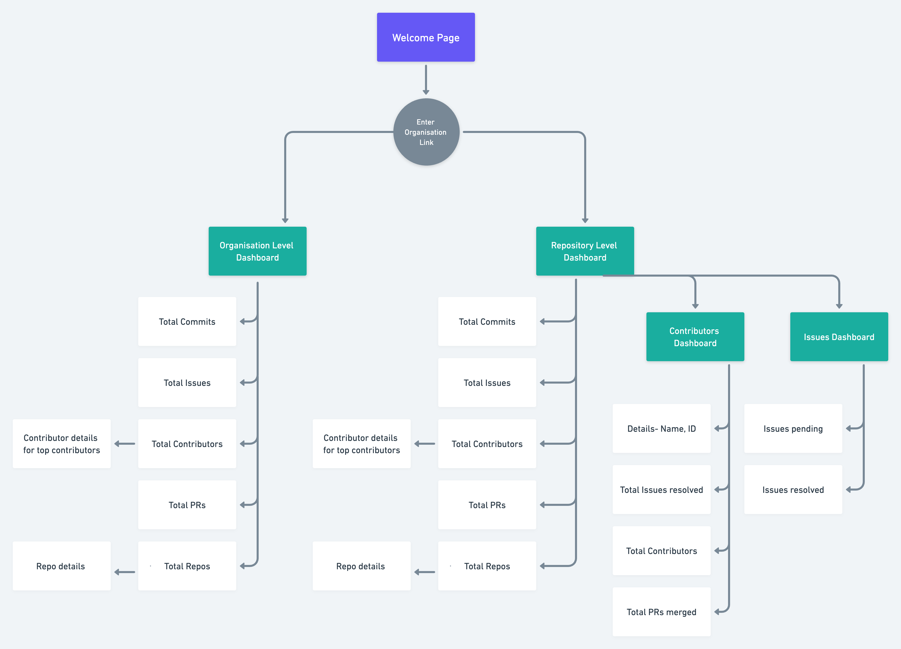
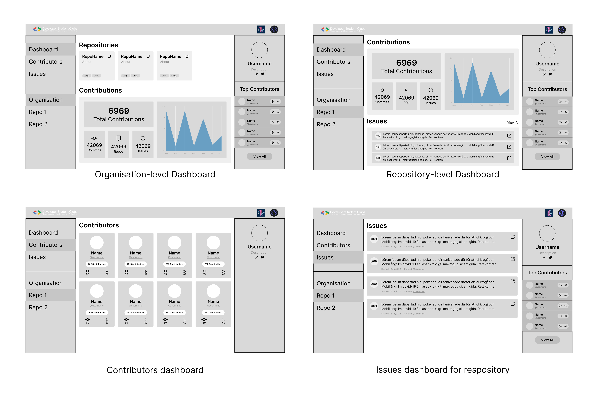

# Hacktoberfest Tracker-Backend

## About Project

Hacktoberfest contributions is aimed at helping organisations track any updates in the GitHub repositories participating in Hacktoberfest with respect to commits made, PRs raised and the contributors.
The web-app is planned to be developed in MERN stack (using Typescript).<br>

## Our Aim
- The GitHub organisation is entered which is used by the API to check for Hacktoberfest projects and and get all the required data.
    → *or can just put in the repo link*
- The data is provided to the user to analyse and make the necessary decisions with respect to their projects.
- A leaderboard for all the contributors in the organization and particular repositorites.
<br>
<br>

<div align="center">

<br>

The current plan for the project is defined through the information architecture - it represents the pages required to build the web-app and how the data is represented on a selected page.
</div>

# Setup

This is a [Next.js](https://nextjs.org/) project bootstrapped with [`create-next-app`](https://github.com/vercel/next.js/tree/canary/packages/create-next-app).

## Getting Started

First, run the development server:

```bash
npm run dev
# or
yarn dev
```

Open [http://localhost:3000](http://localhost:3000) with your browser to see the result.

You can start editing the page by modifying `pages/index.tsx`. The page auto-updates as you edit the file.

[API routes](https://nextjs.org/docs/api-routes/introduction) can be accessed on [http://localhost:3000/api/hello](http://localhost:3000/api/hello). This endpoint can be edited in `pages/api/hello.ts`.

The `pages/api` directory is mapped to `/api/*`. Files in this directory are treated as [API routes](https://nextjs.org/docs/api-routes/introduction) instead of React pages.

## Learn More

To learn more about Next.js, take a look at the following resources:

- [Next.js Documentation](https://nextjs.org/docs) - learn about Next.js features and API.
- [Learn Next.js](https://nextjs.org/learn) - an interactive Next.js tutorial.

You can check out [the Next.js GitHub repository](https://github.com/vercel/next.js/) - your feedback and contributions are welcome!

## Deploy on Vercel

The easiest way to deploy your Next.js app is to use the [Vercel Platform](https://vercel.com/new?utm_medium=default-template&filter=next.js&utm_source=create-next-app&utm_campaign=create-next-app-readme) from the creators of Next.js.

Check out our [Next.js deployment documentation](https://nextjs.org/docs/deployment) for more details.


## Design and Prototypes 
<br>
<div align="center">

<br>

### The design system and the low-fidelity prototype designed for the project can be found in the [Figma project](https://www.figma.com/file/wql8yk5cjh46zWVMCcEiCw/Hacktober?node-id=622%3A773).
</div>

<br>

### The backend setup is currently under progress, the issues will be listed once the core setup is complete and the project will be open for contributions.
<br>

# How to Contribute

We follow a systematic Git Workflow -

- Create a fork of this repo.
- Clone your fork of your repo on your pc.
- [Add Upstream to your clone](https://help.github.com/en/github/collaborating-with-issues-and-pull-requests/configuring-a-remote-for-a-fork)
- **Every change** that you do, it has to be on a branch. Commits on master would directly be closed.
- Make sure that before you create a new branch for new changes, [syncing with upstream](https://help.github.com/en/github/collaborating-with-issues-and-pull-requests/syncing-a-fork) is necessary.

<aside>

☝ Make sure you have read the [Contributions](https://github.com/developer-student-club-thapar/hacktoberfest-tracker/blob/main/CONTRIBUTIONS.md) before you start contributing such that you make remarkable and easily acceptable PRs.
</aside>

<br>
<br>

# GDSC TIET

<div align="center">


# DEVELOPER STUDENT CLUBS TIET

<a href="https://medium.com/developer-student-clubs-tiet"></a>
<a href="https://twitter.com/dsctiet"></a>
<a href="https://www.linkedin.com/company/developer-student-club-thapar"></a>
<a href="https://facebook.com/dscthapar"></a>
<a href="https://instagram.com/dsc.tiet"></a>

## Website: [dsctiet.com](https://dsctiet.com)
</div>